# Architecture Diagram

## System Architecture

```mermaid
graph TB
    subgraph UI["Streamlit UI (app.py)"]
        FORM[Loan Application Form<br/>7 Input Fields]
        RESULT[Results Display<br/>Verdict + Reasons + EMI-to-Income Ratio]
        AUDIT_UI[Audit Log Table<br/>Recent 10 Decisions]
    end

    subgraph HOOKS["Hooks Layer"]
        PRE["Pre-Hooks (5)<br/>validate → sanitize → mask PII → enrich → rate-limit"]
        POST["Post-Hooks (5)<br/>audit → compliance → metrics → bias-check → review-queue"]
    end

    subgraph AGENTS["Multi-Agent System"]
        ORCH["OrchestratorAgent<br/>Autonomous Planner + Self-Healing<br/>Retry with backoff, fallback rules engine"]
        ELIG["EligibilityCheckerAgent<br/>Tool-use loop<br/>check_credit, check_emi_ratio, check_age, check_employment"]
        RISK["RiskAssessorAgent<br/>Tool-use loop<br/>compute_emi, assess_risk_band"]
        EXPL["ExplainerAgent<br/>Rule-based verdict<br/>+ Claude explanation"]
    end

    subgraph TOOLS["Skills / Tools (8 @tool functions)"]
        T1[check_credit_score]
        T2[check_dti_ratio]
        T3[check_age_eligibility]
        T4[check_employment_stability]
        T5[compute_loan_emi]
        T6[assess_risk_band]
        T7[fetch_policy_rules]
        T8[check_bias_indicators]
    end

    subgraph MCP["MCP Servers (Multi-MCP Integration)"]
        MCP1["LoanRulesMCP :8765<br/>FastMCP<br/>get_credit_threshold, get_dti_policy,<br/>get_age_policy, get_employment_policy,<br/>get_loan_products, get_compliance_rules"]
        MCP2["AuditMCP :8766<br/>FastMCP<br/>log_decision, get_decision_history"]
        POLICYDB[("policy_db.py<br/>YAML-backed rules")]
    end

    subgraph GOV["Governance"]
        AUDIT[("audit.db<br/>SQLite — append-only<br/>18-column audit log")]
        COMP["compliance.jsonl<br/>RBI_FAIR_LENDING_2023<br/>structured records"]
        BIAS["bias_report.py<br/>Disparate impact analysis"]
        QUEUE["manual_review_queue.jsonl"]
    end

    subgraph OBS["Observability & Traceability"]
        PROM["Prometheus :9090<br/>6 metrics<br/>Counter, Histogram, Gauge"]
        JSONLOG["loan_agent.jsonl<br/>python-json-logger<br/>JSON structured logs"]
        TRACER["Tracer<br/>UUID trace IDs<br/>span context managers"]
    end

    subgraph API["FastAPI (Load Testing)"]
        APIE["/api/evaluate<br/>POST — run eligibility check"]
        APIH["/health<br/>GET — health check"]
        APIS["/api/stats<br/>GET — audit stats"]
    end

    FORM --> PRE
    PRE --> ORCH
    ORCH -->|"Step 1: Fast-path check"| ORCH
    ORCH -->|"Step 2: Delegate"| ELIG
    ORCH -->|"Step 3: Delegate"| RISK
    ORCH -->|"Step 4: Delegate"| EXPL
    ELIG -->|Tool calls| T1 & T2 & T3 & T4 & T5
    RISK -->|Tool calls| T5 & T6
    T7 -->|HTTP POST| MCP1
    MCP1 --- POLICYDB
    EXPL --> POST
    POST -->|record| AUDIT
    POST -->|write| COMP
    POST -->|metrics| PROM
    POST -->|via HTTP| MCP2
    POST -->|if MANUAL_REVIEW| QUEUE
    TRACER --> JSONLOG
    RESULT --> AUDIT_UI
    AUDIT --> AUDIT_UI
    BIAS -.->|reads| AUDIT

    APIE --> PRE
    APIH -.->|health| APIE

    classDef agent fill:#4A90E2,color:#fff,stroke:#2c6fac
    classDef tool fill:#7EC8E3,color:#333,stroke:#4A90E2
    classDef mcp fill:#7ED321,color:#fff,stroke:#5aaa18
    classDef gov fill:#F5A623,color:#fff,stroke:#d4891a
    classDef obs fill:#9B59B6,color:#fff,stroke:#7d3f99
    classDef hook fill:#1ABC9C,color:#fff,stroke:#148f77
    classDef ui fill:#E8F4FD,color:#333,stroke:#4A90E2
    classDef api fill:#E8F8F5,color:#333,stroke:#1ABC9C

    class ORCH,ELIG,RISK,EXPL agent
    class T1,T2,T3,T4,T5,T6,T7,T8 tool
    class MCP1,MCP2 mcp
    class AUDIT,COMP,BIAS,QUEUE gov
    class PROM,JSONLOG,TRACER obs
    class PRE,POST hook
    class FORM,RESULT,AUDIT_UI ui
    class APIE,APIH,APIS api
```



---

## Data Flow Sequence

```
Browser
  │
  ▼
Streamlit Form (app.py)
  │ generate trace_id = uuid4()
  ▼
Pre-Hooks (5 hooks in chain)
  ├── validate_input        → type/range checks
  ├── sanitize_input        → normalize strings/numbers
  ├── mask_pii              → hash name for audit
  ├── enrich_input          → add derived fields (LTI ratio, age group)
  └── check_rate_limit      → max 10 req/min/session
  │
  ▼
OrchestratorAgent.run()
  ├── _create_plan()        → dynamic execution plan (autonomous planning)
  ├── _check_fast_path()    → skip agents for obvious rejections
  │
  ├── EligibilityCheckerAgent.run()
  │     └── Claude tool-use loop:
  │           fetch_policy_rules → LoanRulesMCP:8765
  │           check_age_eligibility
  │           check_employment_stability
  │           compute_loan_emi
  │           check_credit_score
  │           check_dti_ratio
  │           → EligibilityResult
  │
  ├── RiskAssessorAgent.run()
  │     └── Claude tool-use loop:
  │           compute_loan_emi
  │           assess_risk_band
  │           → RiskBand (LOW/MEDIUM/HIGH/CRITICAL)
  │
  └── ExplainerAgent.run()
        ├── _determine_verdict()  → rule-based verdict (no API)
        ├── _collect_reasons()    → list of reasons
        ├── _generate_explanation() → Claude text generation
        └── → LoanDecision
  │
  ▼
Post-Hooks (5 hooks in chain)
  ├── record_audit_trail    → SQLite audit.db
  ├── check_decision_bias   → bias_checker.py → bias_flags[]
  ├── emit_compliance_log   → compliance.jsonl
  ├── update_metrics        → Prometheus counters/histograms
  └── notify_manual_review  → manual_review_queue.jsonl (if MANUAL_REVIEW)
  │
  ▼
Streamlit Results Display
  ├── Verdict badge (green/red/yellow)
  ├── Key metrics (EMI-to-Income ratio, risk band, credit score)
  ├── Explanation text (from Claude)
  ├── Reasons list
  ├── Recommendations
  └── Audit log table (last 10 decisions)
```

---

## Deployment Architecture

```
┌─────────────────────────────────────────────┐
│               Docker Host / VM               │
│                                              │
│  ┌──────────────┐  ┌──────────────────────┐  │
│  │  Streamlit   │  │  FastAPI (api.py)    │  │
│  │  :8501       │  │  :8000               │  │
│  └──────┬───────┘  └──────────┬───────────┘  │
│         │                     │              │
│  ┌──────▼─────────────────────▼───────────┐  │
│  │        OrchestratorAgent               │  │
│  │   (Multi-Agent Pipeline)               │  │
│  └──────────────────┬───────────────────── ┘  │
│                     │                         │
│  ┌──────────────────▼───────────────────────┐ │
│  │  MCP Servers (daemon threads)            │ │
│  │  LoanRulesMCP :8765  │  AuditMCP :8766   │ │
│  └──────────────────────────────────────────┘ │
│                                               │
│  ┌────────────┐  ┌──────────┐  ┌───────────┐ │
│  │ audit.db   │  │ logs/    │  │ Prometheus │ │
│  │ (SQLite)   │  │ *.jsonl  │  │ :9090      │ │
│  └────────────┘  └──────────┘  └───────────┘ │
│                                               │
│  External: Anthropic Claude API               │
└───────────────────────────────────────────────┘
```
